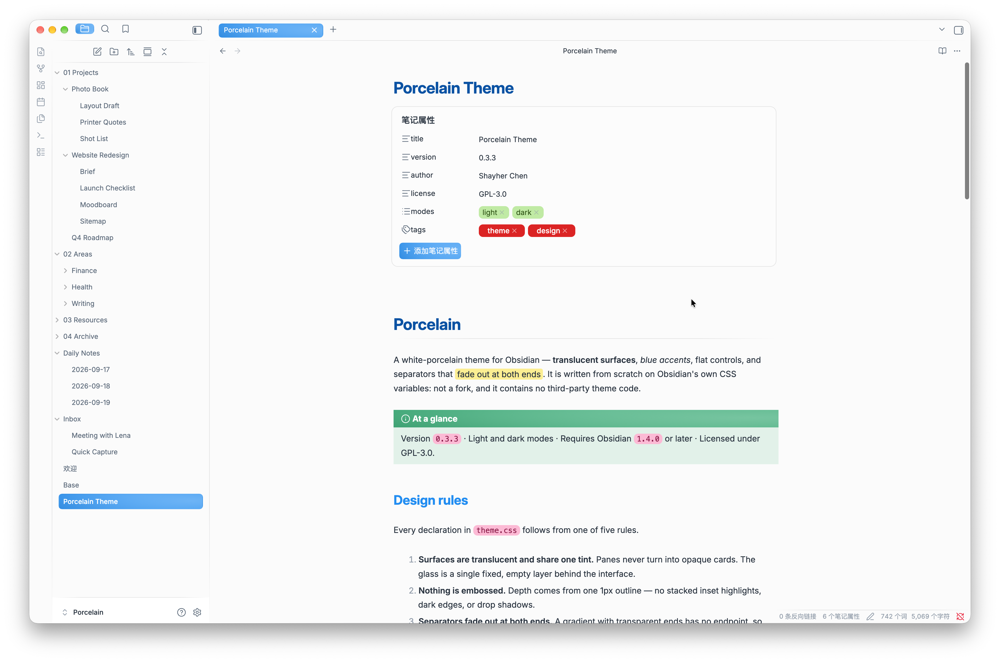
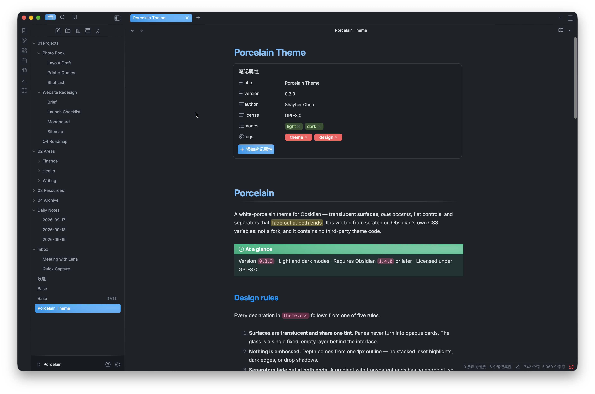

  

<h1 align="center">Porcelain for <a href="https://obsidian.md/">Obsidian</a></h1>

  
  
  
   
  

<table>
  <tr>
    <td></td>
    <td></td>
  </tr>
</table>

**English** · [中文](i18n/README_zh.md) · [日本語](i18n/README_ja.md) · [한국어](i18n/README_ko.md) · [Français](i18n/README_fr.md) · [Español](i18n/README_es.md) · [Italiano](i18n/README_it.md)

A white-porcelain Obsidian theme — translucent surfaces, blue accents, flat controls,
separators that fade at both ends.

Written from scratch on Obsidian's own CSS variables. It is not a fork and contains
no third-party theme code.

## Design rules

The theme follows five rules, and every declaration in `theme.css` is downstream of
one of them:

1. **Surfaces are translucent and share one tint.** Panes are not opaque cards. The
   glass is a single fixed, empty layer — putting `backdrop-filter` on a container
   that holds the interface makes every child repaint invalidate the whole filtered
   layer, so hovering a file list costs a full-window blur recompute.
2. **Nothing is embossed.** Depth comes from one 1px outline. No stacked inset
   highlights, dark inset edges, or drop shadows.
3. **Separators fade out at both ends.** A border spans its element exactly, so
   sibling containers with different padding produce lines that start and stop at
   different offsets. A gradient with transparent ends has no endpoint to misalign.
4. **Colored blocks carry an off-axis bloom.** Three radial gradients with different
   focal points, sizes, and falloffs — no linear direction reads through.
5. **State changes alter color only.** Never padding, border width, or position, so
   nothing shifts under the cursor.

## Install

1. Download `manifest.json` and `theme.css`.
2. Put both in `<vault>/.obsidian/themes/Porcelain/`.
3. *Settings → Appearance → Themes* → **Porcelain**.

### Recommended

- *Appearance → Translucent window*: **on**. The surfaces are translucent by design;
  with it off they render as flat color.

## Customising

Tokens are declared at the top of `theme.css` under `.theme-light` / `.theme-dark`
and `body`. The ones worth knowing:

| Variable | Controls |
| --- | --- |
| `--pc-tint` / `--pc-veil` | Base surface color (rgb triplet) and coverage |
| `--pc-sidebar-tint` / `--pc-sidebar-veil` | How far the sidebars sit off the content plane |
| `--pc-line` | Separator and outline color |
| `--pc-blue` / `--pc-orange` | Selection and hover fills |
| `--pc-bloom-light` / `--pc-bloom-dark` | Bloom gradient strength on colored blocks |
| `--pc-fade-in` / `--pc-fade-out` | Where separators start and stop fading |
| `--pc-popup-bg` / `--pc-popup-blur` | Menu, modal, and settings glass |

Override them in a CSS snippet rather than editing `theme.css`, so updates don't
overwrite your changes.

## Plugin support

- **Notebook Navigator** — selection and hover states, quick-action buttons, and
  header layout are matched to the theme.

## License

GPL-3.0. See [LICENSE](LICENSE).

You may use, modify, and redistribute it, including commercially. If you
distribute a modified version, it has to stay under GPL-3.0, ship its source,
and state that it was changed.
