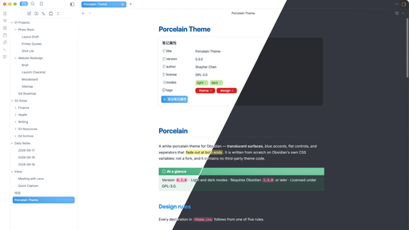

# Porcelain

[English](README.md) · [中文](README_zh.md) · **한국어** · [日本語](README_ja.md) · [Français](README_fr.md) · [Español](README_es.md) · [Italiano](README_it.md)

백자기 질감의 Obsidian 테마 — 반투명 표면, 파란색 액센트, 플랫 컨트롤, 양쪽 끝이 페이드아웃되는 구분선.

Obsidian 자체 CSS 변수를 기반으로 처음부터 작성했습니다. 포크가 아니며 타사 테마 코드를 포함하지 않습니다.

## 디자인 원칙

테마는 다섯 가지 원칙을 따르며, `theme.css`의 모든 선언은 그중 하나에서 비롯됩니다.

1. **표면은 반투명하며 동일한 색조를 공유합니다.** 페인은 불투명한 카드가 아닙니다. 유리는 단일 고정 빈 레이어입니다 — 인터페이스를 담는 컨테이너에 `backdrop-filter`를 적용하면 하위 요소가 다시 그려질 때마다 필터된 레이어 전체가 무효화되어, 파일 목록에 마우스를 올리는 것만으로도 전체 창의 블러를 다시 계산하게 됩니다.
2. **엠보싱 효과가 없습니다.** 깊이는 1px 아웃라인 하나에서 나옵니다. 겹친 인셋 하이라이트, 어두운 안쪽 가장자리, 드롭 섀도가 없습니다.
3. **구분선은 양쪽 끝에서 페이드아웃됩니다.** 테두리는 요소에 정확히 걸쳐 있으므로, 패딩이 다른 인접 컨테이너는 시작과 끝이 어긋난 선을 만듭니다. 양끝이 투명한 그라데이션에는 어긋날 끝점이 없습니다.
4. **색상 블록에는 축에서 벗어난 글로우가 있습니다.** 초점, 크기, 감쇠가 다른 세 개의 방사형 그라데이션 — 어떤 선형 방향도 읽히지 않습니다.
5. **상태 변화는 색상만 변경합니다.** 패딩, 테두리 두께, 위치는 절대 바꾸지 않으므로 커서 아래에서 아무것도 움직이지 않습니다.

## 설치

1. `manifest.json`과 `theme.css`를 다운로드합니다.
2. 두 파일을 `<vault>/.obsidian/themes/Porcelain/`에 넣습니다.
3. *설정 → 모양 → 테마* → **Porcelain**을 선택합니다.

### 권장 설정

- *모양 → 반투명 창*: **켜기**. 표면은 설계상 반투명입니다. 끄면 평면 색상으로 렌더링됩니다.

## 사용자 지정

토큰은 `theme.css` 상단의 `.theme-light` / `.theme-dark` 및 `body`에 선언되어 있습니다. 알아두면 좋은 것들:

| 변수 | 제어 항목 |
| --- | --- |
| `--pc-tint` / `--pc-veil` | 기본 표면 색상(RGB 트리플) 및 커버리지 |
| `--pc-sidebar-tint` / `--pc-sidebar-veil` | 사이드바가 콘텐츠 평면에서 벗어난 정도 |
| `--pc-line` | 구분선 및 아웃라인 색상 |
| `--pc-blue` / `--pc-orange` | 선택 및 호버 채움 |
| `--pc-bloom-light` / `--pc-bloom-dark` | 색상 블록의 글로우 그라데이션 강도 |
| `--pc-fade-in` / `--pc-fade-out` | 구분선이 페이드되기 시작하고 끝나는 위치 |
| `--pc-popup-bg` / `--pc-popup-blur` | 메뉴, 모달, 설정의 유리 효과 |

`theme.css`를 직접 수정하지 말고 CSS 스니펫에서 이 변수들을 재정의하세요. 그래야 업데이트가 변경 사항을 덮어쓰지 않습니다.

## 플러그인 지원

- **Notebook Navigator** — 선택 및 호버 상태, 빠른 작업 버튼, 헤더 레이아웃이 테마에 맞춰져 있습니다.

## 라이선스

GPL-3.0. [LICENSE](LICENSE)를 참조하세요.

상업적 사용을 포함해 사용, 수정, 재배포할 수 있습니다. 수정된 버전을 배포하는 경우 GPL-3.0을 유지하고, 소스 코드를 포함하며, 변경되었음을 명시해야 합니다.
